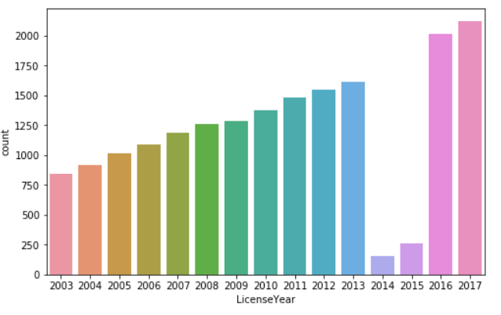
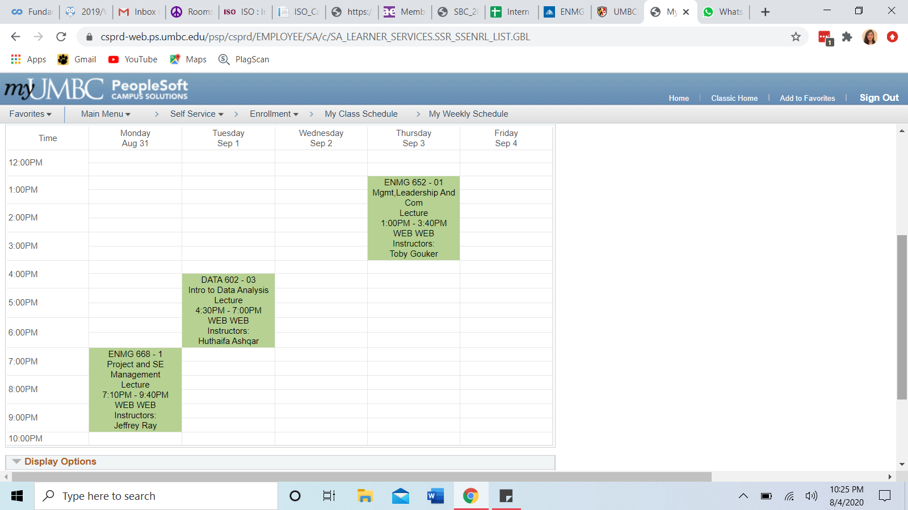

# Liquor_License_SanaSharma_OH63534
# Overview
I am using the Baltimore County Liquor License to create a model for predicting ZipCodes according to other data. For example: if you specify fees, then it can give you zipcode related to that cost. It is efficient to predict correctly 75% of the time.
# Repository Navigation
Code               : Notebooks
Presentation       : Slide Deck
# Data
The dataset is obtained from DATA.GOV. It is provided by the Baltimore City Liquor License Board and describes the Baltimore County Liquor License Status from 2003 - 2017. It includes 20.8K observations and 19 columns. 

## Example
* Example 1 
* eg 2

