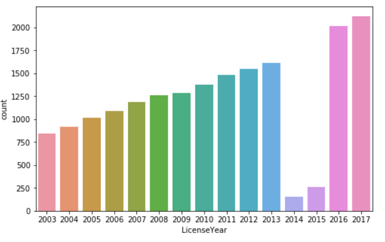

# Liquor_License_SanaSharma_OH63534
# Overview
I am using the Baltimore County Liquor License to create a model for predicting ZipCodes according to other data. For example: if you specify fees, then it can give you zipcode related to that cost. It is efficient to predict correctly 75% of the time.
# Repository Navigation
Code               : [Notebooks](https://github.com/sanashar/Liquor_License_OH63534/tree/master/notebook)

Presentation       : [Slide Deck](https://github.com/sanashar/Liquor_License_OH63534/blob/master/Data602_Assignment1_SummaryReport.docx)
# Data
The dataset is obtained from [data.gov](https://catalog.data.gov/sv/dataset/liquor-licenses-5a0dc). It is provided by the [Baltimore City Liquor License Board](https://data.baltimorecity.gov/City-Services/Restaurants-Bars-and-Taverns-in-21224/wdpa-2rxb) and describes the Baltimore County Liquor License Status from 2003 - 2017. It includes 20.8K observations and 19 columns. 

# Results
Explained variance: 75%

The model can predict ZipCodes related to any other data with 75% accuracy
# Project Info
DATA 602 Assignment 1 - Sana Sharma

Languages    : Python

Tools/IDE    : Anaconda

Libraries    : pandas, matplotlib, statsmodels, sklearn
